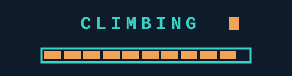
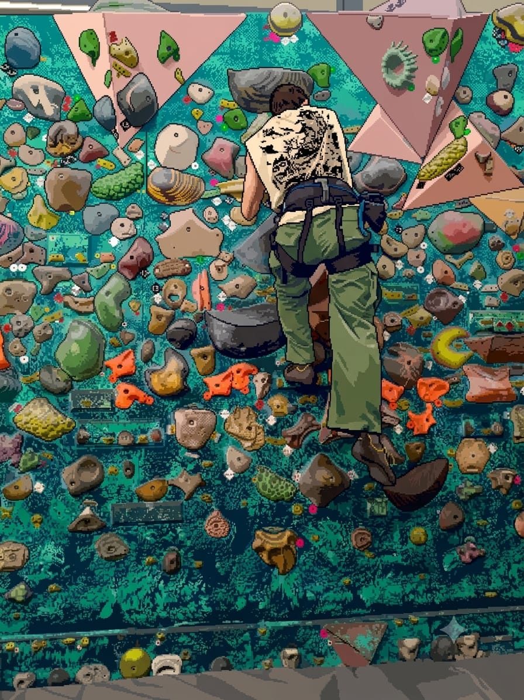
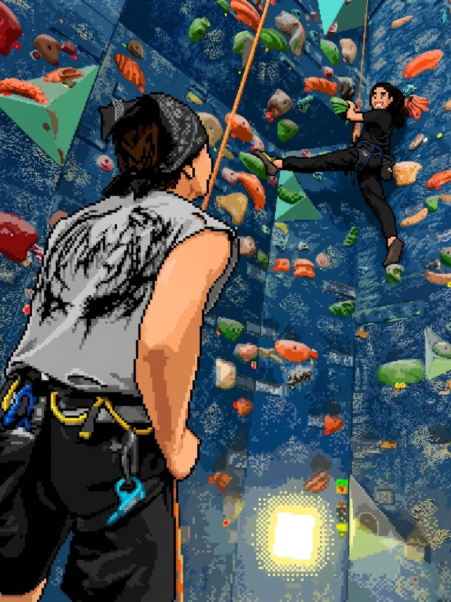

 

# João Victor | Desenvolvedor de Software.
Fui bombeiro militar, mecânico retificador e soldador. Hoje trago essa expertise de resolução de problemas pra cá. Sou um homem comum que 
escala, corre e pratica powerlifting, afundado na constante vontade de me aperfeiçoar ao máximo naquilo que me proponho.
Sou um entusiasta de cinema e **eu acredito que se você quer ganhar na loteria, precisa fazer a grana para comprar o bilhete.**

## Stack

---

 Gosto da ideia de "gamificar" aplicações e trazer isso para criar aderência na utilização delas. Quero criar coisas genuinamente úteis e que ajudarão, ou, 
 pelo menos, serão divertidas de usar e implementar no cotidiano.
 A ideia da codificação nada mais é que a expressão tecnológica da arte sem limitações, contudo, o preço que se cobra é a capacidade de metacriar aquilo que se pensa no editor de código e posteriormente publicá-lo em algum lugar que dê visibilidade 
 a aquilo que foi "desenhado" pelas letrinhas coloridas. Grande adepto do uso de IA.

  
<footer> ©JoaoVPZDev </footer>

