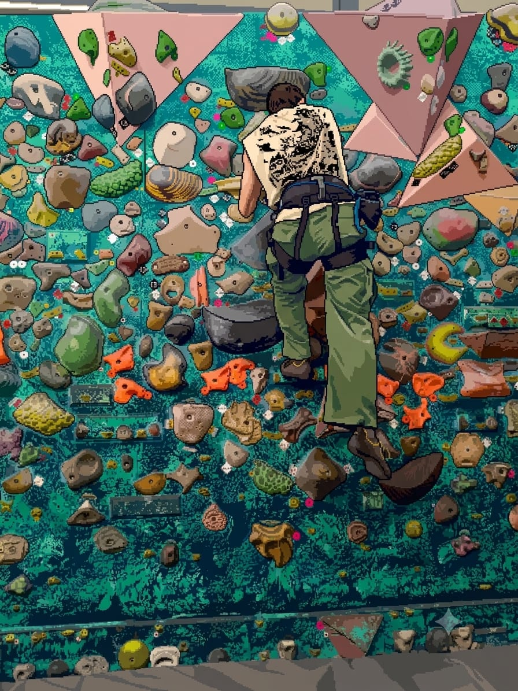
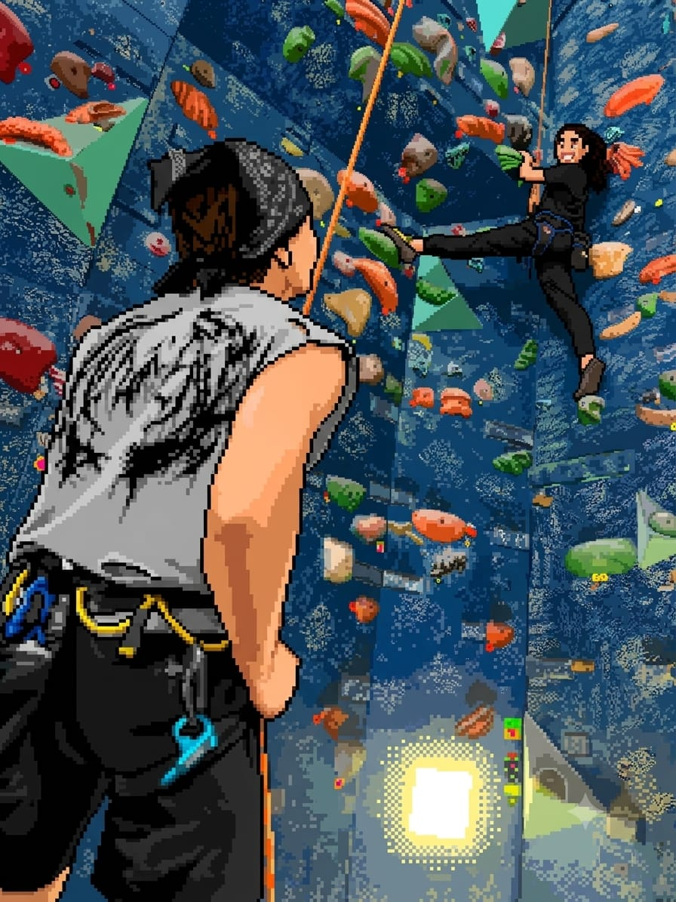

 

# João Victor | Software Developer.
I was a military firefighter, a reconditioning mechanic, and a welder. Today I bring that problem-solving expertise here. I'm an ordinary man who climbs, runs, and practices powerlifting, driven by a constant desire to improve as much as possible in whatever I set out to do. I'm a movie enthusiast, and I believe that if you want to win the lottery, you need to make the money to buy the ticket.**

## Stack

---

I like the idea of "gamifying" apps and bringing that in to create adherence in their use. I want to create things that are genuinely useful and that will help, or at least, be fun to use and implement in daily life. The idea of coding is nothing more than the technological expression of art without limitations; however, the price you pay is the ability to meta-create what you think in the code editor and later publish it somewhere that gives visibility to what was "designed" by the little colorful letters. Big supporter of using AI.

  

 

<footer> ©JoaoVPZDev </footer>

