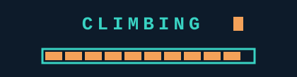

  

# João Victor Paixão Zolim | Cyber Security

**SOC · Pentest** · Ethical Hacker (Cisco) · Oracle Cloud Infrastructure Foundations Associate

I'm changing careers into Information Security. Before this, I was a military firefighter, a reconditioning mechanic, and a welder, and I bring the discipline, the calm under pressure, and the habit of solving problems hands-on from those fields. I learn by building: every project below started as a question I wanted to answer with a working lab.

## Featured Projects

### Blue Team: monitoring, detection, and response

| Project | What it does | Stack |
|---|---|---|
| [zabbix-security-monitoring](https://github.com/joaovpzdev/zabbix-security-monitoring) | Security observation lab on a Windows host. Detects failed logins (Event ID 4625), newly installed services (7045), and Windows Defender being disabled, with email alerts. Includes documented troubleshooting. | Zabbix 7.0, Docker, MySQL, PowerShell |
| [sec-dash-zabbix](https://github.com/joaovpzdev/sec-dash-zabbix) | Dashboard that consumes the Zabbix API and shows the last 24 hours of alerts with severity charts. | Python, Flask, Chart.js |
| [soar-triagem](https://github.com/joaovpzdev/soar-triagem) | Receives SIEM alerts via webhook, enriches the IP with AbuseIPDB, and escalates to Slack according to risk. | Python, Flask, Redis, SQLite, Docker Compose |
| [checklist-hardening](https://github.com/joaovpzdev/checklist-hardening) | Read-only audit of SSH, firewall, updates, and accounts without passwords, with a PASS/WARN/FAIL report. | Bash, Linux |
| [leak-monitor](https://github.com/joaovpzdev/leak-monitor) | Checks emails against data breach databases and alerts only on new leaks. | Node.js, cron, Slack/Discord |

### Red Team: reconnaissance, OSINT, and findings management

| Project | What it does | Stack |
|---|---|---|
| [pentest-findings-dash](https://github.com/joaovpzdev/pentest-findings-dash) | Pentest findings management: imports Nmap, Nuclei, and Burp Suite output, deduplicates re-imports, and tracks remediation. | Node.js, React, PostgreSQL, Prisma |
| [visual-recon](https://github.com/joaovpzdev/visual-recon) | Captures a screenshot, title, and technologies for each host and builds an HTML gallery for visual triage. | Node.js, Headless Chromium |
| [cyber-sec-journey](https://github.com/joaovpzdev/cyber-sec-journey) | Documentation of my studies: pentest methodology, Kali Linux tools, SQL Injection, and Bash. | Kali Linux, Bash |

---

## Stack

**Security and infrastructure**

**Development**

---

## Certifications

- **Ethical Hacker**, Cisco
- **Introduction to Cybersecurity**, Cisco
- **Oracle Cloud Infrastructure Foundations Associate**, Oracle

---

## Work in Progress

- Expand the monitoring lab with Linux agents and encrypted communication (TLS/PSK) between agent and server
- Integrate the triage SOAR with a commercial SIEM
- Document each lesson learned with screenshots and step-by-step reproduction instructions

---

## Ethical Use Notice

The reconnaissance and pentest tools in this profile are educational and must be used **only in environments you own or have written authorization to test**.

---

## Contact

[joaovpz.dev@gmail.com](mailto:joaovpz.dev@gmail.com) · [LinkedIn](https://www.linkedin.com/in/joao-victor-paixao-zolim)

Away from the computer: climber, runner, and powerlifter.

<footer> ©JoaoVPZDev </footer>
